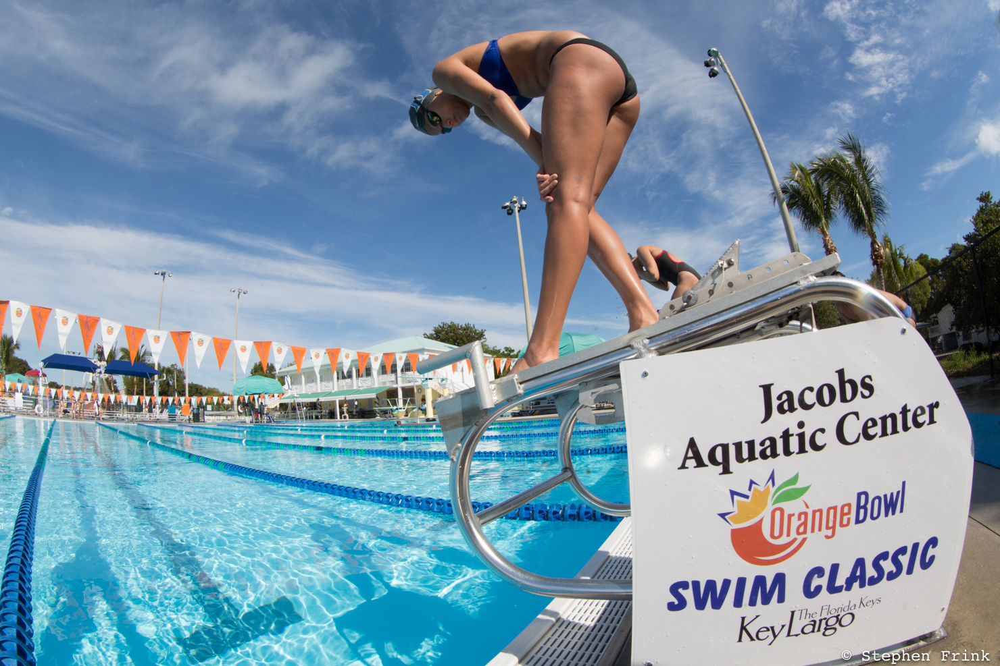
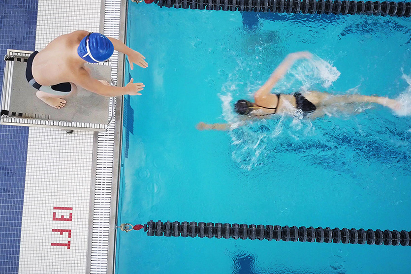
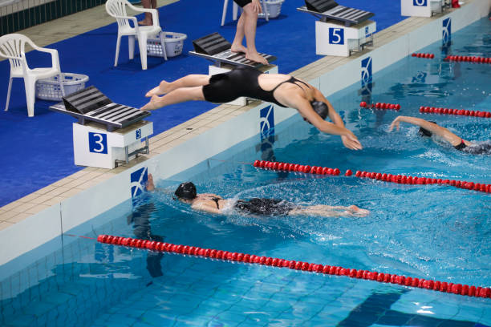

# How to do a Relay Start in Swimming
---
Swimming competitively is not just done individually, relays are often apart of competitions. Relays mostly consist of four members to complete one race. Except for the first member, the others utilize a different way to start their portion of the swim, a relay start.

# Warning
---
 #### Head and cervical injuries can result from improper diving, use caution.

 
# Items
-----
- Swimming Pool
- Starting Block
- Bathing Suit

# Steps
---
#### 1. Step up on to starting block

#### 2. Position self near back of the block

#### 3. Place left foot at the back of the block with right foot a half step forward
- feet should be about shoulder width apart.

#### 3. Extend arms in front of you at about 65 degree angle towards pool pool

#### 5. Use your hands to form a triangle in front of you 
- Pay attention for when swimmer in water enters the triangle

#### 6. When swimmer enters triangle, throw your arms backwards in a circle 

#### 7. As your arms come down behind your back, take a step forward with left foot
- Make sure your step comes near the front of the block

#### 8. When your arms come forward, leap off the block
- Make sure the swimmer in water is touching the wall around when you leap off block

#### 9. Press arms out in front of you, squeezing your head between biceps so you're in a streamline
- Should almost look like a pencil
- Be ready to hit the water and start your race

